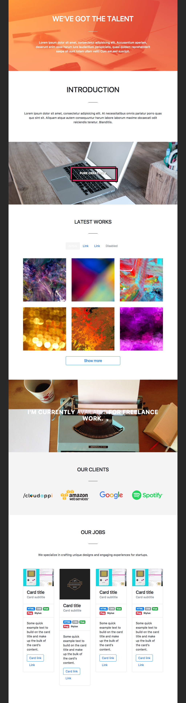

# SIBY Template 
SIBY - Free Bootstrap 4 HTML Template (_WIP_)

## Getting Started

- Install: `npm install --global yo gulp-cli bower generator-webapp`
- Run `yo webapp` to scaffold your webapp
- Run `gulp serve` to preview and watch for changes
- Run `bower install --save <package>` to install frontend dependencies
- Run `gulp serve:test` to run the tests in the browser
- Run `gulp` to build your webapp for production
- Run `gulp serve:dist` to preview the production build
